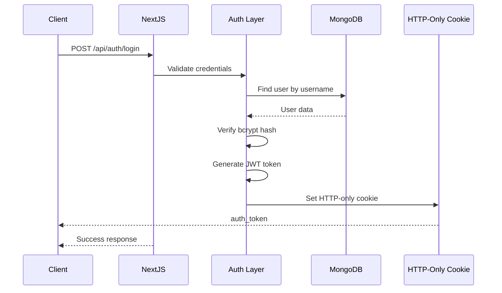
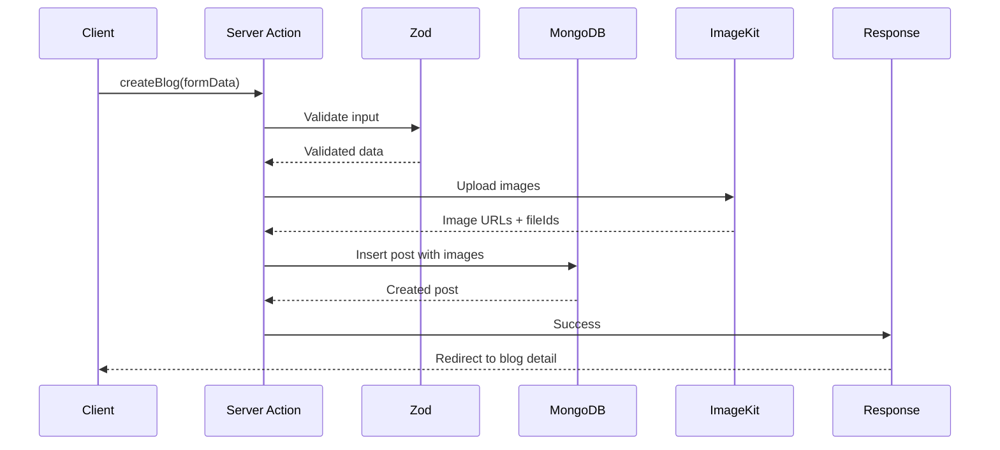
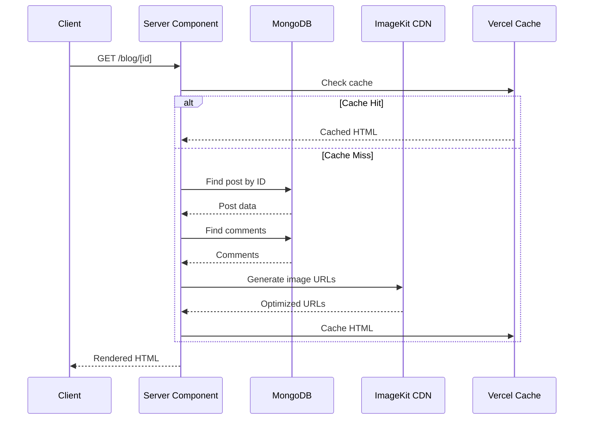
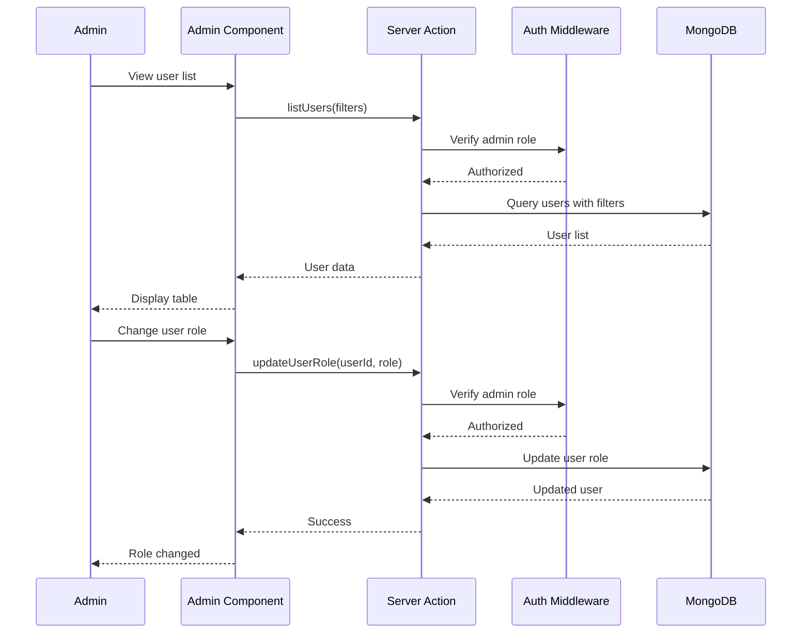
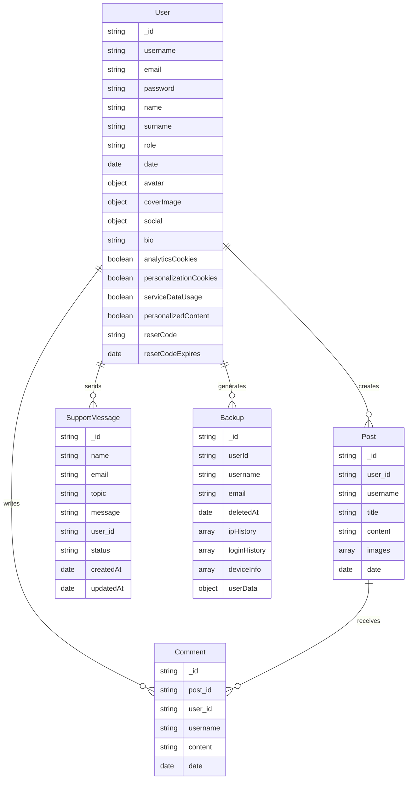

# System Architecture

## Detailed Technical Architecture

Bu doküman, MSFL Tarih Kulübü Next.js rewrite'ının detaylı teknik mimarisini ve data flow diagramlarını içerir.

## System Components

### 1. Client Layer

```
┌─────────────────────────────────────────────────────────┐
│                    Client Browser                        │
│  ┌──────────────┐  ┌──────────────┐  ┌──────────────┐  │
│  │ Static HTML  │  │ React Client │  │  next/image  │  │
│  │  (SSR)       │  │  Components  │  │  Optimization│  │
│  └──────────────┘  └──────────────┘  └──────────────┘  │
└─────────────────────────────────────────────────────────┘
```

**Components**:
- Static HTML (Server Components output)
- React Client Components (interactivity)
- Image optimization (next/image)
- CSS (Tailwind CSS v4)

### 2. Next.js App Router Layer

```
┌─────────────────────────────────────────────────────────┐
│                  Next.js App Router                     │
│  ┌──────────────┐  ┌──────────────┐  ┌──────────────┐  │
│  │ Server Comps  │  │Route Handlers│  │Server Actions│  │
│  │  (RSC)       │  │   (API)      │  │  (Mutations)  │  │
│  └──────────────┘  └──────────────┘  └──────────────┘  │
└─────────────────────────────────────────────────────────┘
```

**Components**:
- Server Components (RSC) - rendering
- Route Handlers - API endpoints
- Server Actions - mutations
- Middleware - auth, redirects

### 3. Business Logic Layer

```
┌─────────────────────────────────────────────────────────┐
│                 Business Logic Layer                    │
│  ┌──────────────┐  ┌──────────────┐  ┌──────────────┐  │
│  │  Auth Logic  │  │  Validation  │  │  Services    │  │
│  │  (JWT/Cookie)│  │   (Zod)      │  │(ImageKit/Mail)│  │
│  └──────────────┘  └──────────────┘  └──────────────┘  │
└─────────────────────────────────────────────────────────┘
```

**Components**:
- Authentication/Authorization
- Input Validation (Zod)
- External Services (ImageKit, SendGrid)
- Business Rules

### 4. Data Access Layer

```
┌─────────────────────────────────────────────────────────┐
│                  Data Access Layer                       │
│  ┌──────────────┐  ┌──────────────┐  ┌──────────────┐  │
│  │ Repositories │  │MongoDB Driver│  │ Connection    │  │
│  │  (CRUD)      │  │  (Native)    │  │  Pooling     │  │
│  └──────────────┘  └──────────────┘  └──────────────┘  │
└─────────────────────────────────────────────────────────┘
```

**Components**:
- Repository Pattern
- MongoDB Native Driver
- Connection Pooling (serverless)

### 5. External Services Layer

```
┌─────────────────────────────────────────────────────────┐
│                External Services Layer                    │
│  ┌──────────────┐  ┌──────────────┐  ┌──────────────┐  │
│  │   MongoDB    │  │   ImageKit   │  │   SendGrid   │  │
│  │  (Database)  │  │  (Media)     │  │   (Email)    │  │
│  └──────────────┘  └──────────────┘  └──────────────┘  │
└─────────────────────────────────────────────────────────┘
```

**Components**:
- MongoDB Atlas (database)
- ImageKit (media storage)
- SendGrid (email service)

## Data Flow Diagrams

### Authentication Flow



### Blog Creation Flow



### Public Blog Reading Flow



### Admin User Management Flow



## Component Interactions

### Request Flow (Public Page)

```
1. Client Request
   ↓
2. Next.js Middleware (auth check, redirects)
   ↓
3. Route Handler / Server Component
   ↓
4. Authentication Check (if needed)
   ↓
5. Data Fetching (MongoDB via repositories)
   ↓
6. External Service Calls (ImageKit, etc.)
   ↓
7. Rendering (Server Component → HTML)
   ↓
8. Response (HTML + Client Component bundles)
   ↓
9. Client Hydration (React interactivity)
```

### Request Flow (Mutation)

```
1. Client Form Submit
   ↓
2. Server Action / Route Handler
   ↓
3. Input Validation (Zod)
   ↓
4. Authorization Check
   ↓
5. Business Logic Execution
   ↓
6. External Service Calls (ImageKit upload, SendGrid)
   ↓
7. Database Operations (MongoDB)
   ↓
8. Response (Success/Error)
   ↓
9. Client Redirect / UI Update
```

## Database Schema Relationships



## Security Architecture

### Authentication Layer

```
┌─────────────────────────────────────────────────────────┐
│              Authentication Layer                        │
│                                                          │
│  1. JWT Token Generation                                 │
│     - User ID, Username, Role                           │
│     - 7-day expiration (user), 6-hour (admin)           │
│     - HMAC-SHA256 signing                               │
│                                                          │
│  2. HTTP-Only Cookie Storage                             │
│     - Secure flag (production)                          │
│     - SameSite: lax                                      │
│     - httpOnly: true                                    │
│                                                          │
│  3. Middleware Validation                                │
│     - Token verification on each request                 │
│     - User context population                           │
│     - Automatic token refresh (optional)               │
└─────────────────────────────────────────────────────────┘
```

### Authorization Layer

```
┌─────────────────────────────────────────────────────────┐
│              Authorization Layer                         │
│                                                          │
│  Role-Based Access Control (RBAC)                       │
│                                                          │
│  Roles:                                                  │
│  - user: Standard user permissions                      │
│  - admin: Full system access                            │
│                                                          │
│  Permissions:                                           │
│  - read_public: Read public content                     │
│  - read_own: Read own content                           │
│  - create_own: Create own content                       │
│  - update_own: Update own content                       │
│  - delete_own: Delete own content                       │
│  - admin_all: Full admin access                         │
└─────────────────────────────────────────────────────────┘
```

### Input Validation Layer

```
┌─────────────────────────────────────────────────────────┐
│              Input Validation Layer                      │
│                                                          │
│  Zod Schema Validation                                  │
│                                                          │
│  Validation Types:                                      │
│  - String validation (email, username, URL)             │
│  - Number validation (limits, ranges)                   │
│  - Array validation (length, item types)                │
│  - Object validation (required fields)                  │
│  - Custom validation (business rules)                  │
│                                                          │
│  Sanitization:                                          │
│  - Trim whitespace                                      │
│  - HTML escape (user content)                           │
│  - SQL/NoSQL injection prevention                       │
└─────────────────────────────────────────────────────────┘
```

## Caching Strategy

### MongoDB Connection Caching

```typescript
// Serverless-compatible connection pooling
let cachedConnection: typeof mongoose | null = null;

async function getConnection() {
  if (cachedConnection) return cachedConnection;

  cachedConnection = await mongoose.connect(MONGO_URL);
  return cachedConnection;
}
```

### Page Caching

```
┌─────────────────────────────────────────────────────────┐
│              Caching Strategy                            │
│                                                          │
│  Static Pages:                                           │
│  - ISR (Incremental Static Regeneration)                │
│  - Revalidate: 1 hour                                   │
│                                                          │
│  Dynamic Pages:                                          │
│  - No caching (always fresh)                            │
│  - Client-side caching where appropriate                │
│                                                          │
│  Images:                                                │
│  - ImageKit CDN (global)                                │
│  - next/image optimization                             │
│  - Browser caching headers                              │
│                                                          │
│  API Responses:                                         │
│  - Vercel Edge caching (GET endpoints)                  │
│  - Short TTL (5-15 minutes)                             │
└─────────────────────────────────────────────────────────┘
```

## Error Handling Architecture

### Error Categories

```
┌─────────────────────────────────────────────────────────┐
│              Error Handling                             │
│                                                          │
│  1. Client Errors (4xx)                                  │
│     - 400: Bad Request (validation error)               │
│     - 401: Unauthorized (not logged in)                 │
│     - 403: Forbidden (no permission)                   │
│     - 404: Not Found (resource missing)                 │
│     - 429: Too Many Requests (rate limit)              │
│                                                          │
│  2. Server Errors (5xx)                                 │
│     - 500: Internal Server Error                         │
│     - 503: Service Unavailable (DB down)                │
│                                                          │
│  3. Error Response Format                               │
│     {                                                   │
│       error: "Error message",                           │
│       code: "ERROR_CODE",                               │
│       details: { ... }                                  │
│     }                                                   │
└─────────────────────────────────────────────────────────┘
```

## Performance Optimization

### Rendering Optimization

```
┌─────────────────────────────────────────────────────────┐
│              Rendering Optimization                     │
│                                                          │
│  Server Components:                                     │
│  - No client JavaScript for static content              │
│  - Direct database access                              │
│  - Reduced bundle size                                  │
│                                                          │
│  Client Components:                                     │
│  - Only for interactivity                              │
│  - Code splitting by route                             │
│  - Lazy loading for heavy components                    │
│                                                          │
│  Streaming:                                             │
│  - Progressive rendering                                │
│  - Suspense boundaries                                 │
│  - Loading states                                       │
└─────────────────────────────────────────────────────────┘
```

### Bundle Optimization

```
┌─────────────────────────────────────────────────────────┐
│              Bundle Optimization                        │
│                                                          │
│  Code Splitting:                                        │
│  - Route-based splitting                                │
│  - Dynamic imports                                      │
│  - Component-level splitting                           │
│                                                          │
│  Tree Shaking:                                          │
│  - Remove unused code                                   │
│  - ESM modules                                          │
│  - Dead code elimination                               │
│                                                          │
│  Minification:                                          │
│  - Terser for JavaScript                                │
│  - CSS optimization                                     │
│  - HTML minification                                    │
└─────────────────────────────────────────────────────────┘
```

## Monitoring & Observability

### Logging Strategy

```
┌─────────────────────────────────────────────────────────┐
│              Logging Strategy                           │
│                                                          │
│  Log Levels:                                            │
│  - error: Critical errors                               │
│  - warn: Warning messages                              │
│  - info: Informational messages                        │
│  - debug: Debug information (dev only)                 │
│                                                          │
│  Log Destinations:                                      │
│  - Console (development)                               │
│  - Vercel Logging (production)                         │
│  - External service (optional, e.g., Sentry)         │
│                                                          │
│  Sensitive Data:                                       │
│  - Never log passwords, tokens, secrets                │
│  - Sanitize user input in logs                         │
│  - Use structured logging                              │
└─────────────────────────────────────────────────────────┘
```

### Performance Monitoring

```
┌─────────────────────────────────────────────────────────┐
│          Performance Monitoring                         │
│                                                          │
│  Vercel Analytics:                                      │
│  - Page views                                           │
│  - Web Vitals                                          │
│  - Core Web Vitals                                      │
│                                                          │
│  Custom Metrics:                                        │
│  - Database query times                                │
│  - API response times                                  │
│  - Error rates                                         │
│  - User engagement                                     │
│                                                          │
│  Real User Monitoring (RUM):                           │
│  - Lighthouse scores                                   │
│  - Performance budgets                                 │
│  - Regression detection                                │
└─────────────────────────────────────────────────────────┘
```

## Deployment Architecture

### Vercel Deployment

```
┌─────────────────────────────────────────────────────────┐
│              Vercel Deployment                          │
│                                                          │
│  Environments:                                          │
│  - Production: main deployment                          │
│  - Preview: pull request deployments                    │
│  - Development: local development                       │
│                                                          │
│  Deployment Process:                                    │
│  1. Git push to rewrite/nextjs                         │
│  2. Vercel webhook triggers build                      │
│  3. Build optimization                                  │
│  4. Deploy to Edge Network                             │
│  5. DNS propagation                                    │
│                                                          │
│  Edge Functions:                                        │
│  - Global distribution                                 │
│  - Middleware execution                                │
│  - Image optimization                                  │
│  - API route handling                                  │
└─────────────────────────────────────────────────────────┘
```

---

This system architecture provides:
1. **Clear separation of concerns** across layers
2. **Scalable data flow** with proper caching
3. **Robust security** at multiple levels
4. **Performance optimization** through modern techniques
5. **Observability** for production monitoring
6. **Deployment readiness** for Vercel platform
